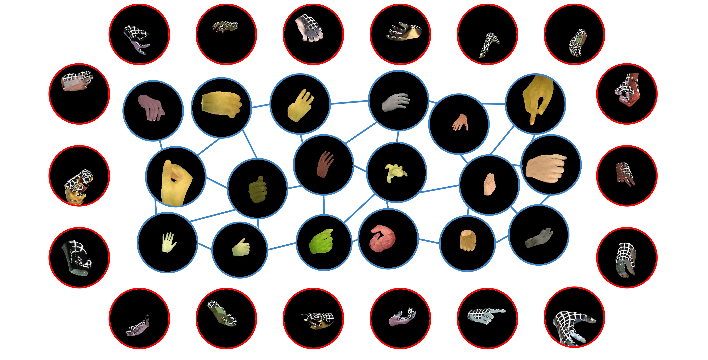

# Enhancing Monocular 3D Hand Reconstruction with Learned Texture Priors  

Official repository for the paper:  

**Enhancing Monocular 3D Hand Reconstruction with Learned Texture Priors**  
*Giorgos Karvounas, Nikolaos Kyriazis, Iason Oikonomidis, Georgios Pavlakos, Antonis A. Argyros*  
[arXiv:2508.09629](https://arxiv.org/abs/2508.09629v1)  

  

---

## 📌 Overview  
This work revisits the role of **texture** in monocular 3D hand reconstruction, treating it not only as a tool for photorealism but as a **dense, spatially grounded supervisory signal** that enhances pose and shape estimation.  

We propose a lightweight, transformer-based **texture module** that consolidates sparse UV–RGB observations into a full texture prior. Integrated into existing pipelines (e.g., HaMeR), our approach delivers measurable accuracy and realism gains, particularly in **occluded and egocentric scenarios**, without adding any test-time overhead.  

---

## 🚀 Key Contributions  
- Introduces the **first unified framework** for learning texture priors from sparse, monocular observations.  
- **Transformer-based module** with pixel-level attention for coherent texture reconstruction.  
- **Weakly-supervised training** using differentiable rendering — no manual annotations required.  
- Improves state-of-the-art monocular hand reconstruction benchmarks (e.g., **+2.7% PCK** on occluded hands).  

---

## 🔧 Setup Pretrained Weights

1. **Download the weights**  
   👉 [texture_supervised_hamer_weights](https://forthgr-my.sharepoint.com/:u:/g/personal/gkarv_ics_forth_gr/IQDIDDN3B6e9RZFraetL-wClAdBcbeMSbRHsjWORwZf5irM?e=eRBnyz)
   These weights have been retrained with our texture–supervised framework, incorporating the learned texture priors described in the paper.

2. **Place the file** into the following directory (after cloning and setting up the [HaMeR repo](https://github.com/geopavlakos/hamer)): hamer/_DATA/hamer_ckpts/checkpoints/

2. **Update [the init file](https://github.com/geopavlakos/hamer/blob/091de2a07b5414a2f9373d2bec368b8c979883b6/hamer/models/__init__.py#L31) with hamer.ckpt -> texture_supervised_hamer_weights.ckpt

---

## 📢 Updates  
- [ ] Release code  
- [ ] Add preparation instructions  
- [ ] Provide demo notebooks  
- [x] Release new weights for HaMeR  
