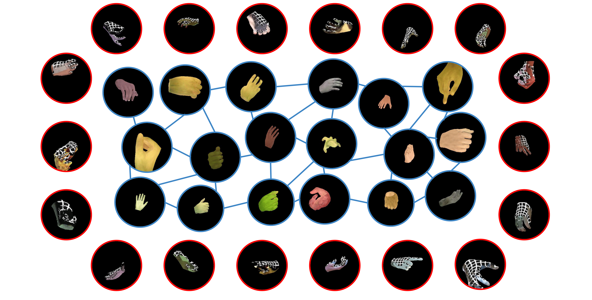

# Enhancing Monocular 3D Hand Reconstruction with Learned Texture Priors

Official repository for the paper:

**Enhancing Monocular 3D Hand Reconstruction with Learned Texture Priors**  
*Giorgos Karvounas, Nikolaos Kyriazis, Iason Oikonomidis, Georgios Pavlakos, Antonis A. Argyros*  
[Paper Page](https://openaccess.thecvf.com/content/WACV2026/papers/Karvounas_Enhancing_Monocular_3D_Hand_Reconstruction_with_Learned_Texture_Priors_WACV_2026_paper.pdf)

<p align="center">
  
</p>

---

## 📌 Overview
This work revisits the role of **texture** in monocular 3D hand reconstruction, treating it not only as a tool for photorealism but as a **dense, spatially grounded supervisory signal** that enhances pose and shape estimation.

We propose a lightweight, transformer-based **texture module** that consolidates sparse UV–RGB observations into a full texture prior. Integrated into existing pipelines such as **HaMeR**, our approach delivers measurable accuracy and realism gains, particularly in **occluded and egocentric scenarios**, without introducing any test-time overhead.

---

## 🚀 Key Contributions
- Introduces the **first unified framework** for learning texture priors from sparse, monocular observations.
- A **transformer-based module** with pixel-level attention for coherent texture reconstruction.
- **Weakly supervised training** through differentiable rendering, without manual texture annotations.
- Improves state-of-the-art monocular hand reconstruction benchmarks, including gains on **occluded hands**.

---

## 🐳 Installation (Docker only)
This project builds on the official [HaMeR](https://github.com/geopavlakos/hamer) codebase and uses its **Docker Compose** setup.

1. **Clone HaMeR recursively**
   ```bash
   git clone --recursive https://github.com/geopavlakos/hamer.git
   cd hamer
   ```

2. **Build and start the Docker container**
   ```bash
   docker compose -f ./docker/docker-compose.yml up -d
   ```

3. **Enter the container**
   ```bash
   docker compose -f ./docker/docker-compose.yml exec hamer-dev /bin/bash
   ```

4. **Download the HaMeR demo data inside the container**
   ```bash
   bash fetch_demo_data.sh
   ```

5. **Download the MANO model**  
   Register on the [MANO website](https://mano.is.tue.mpg.de) and download the right-hand model.  
   Place `MANO_RIGHT.pkl` under:
   ```text
   _DATA/data/mano/
   ```

---

## 🔧 Setup Texture-Supervised Weights
1. **Download the checkpoint**  
   👉 [texture_supervised_hamer_weights](https://forthgr-my.sharepoint.com/:u:/g/personal/gkarv_ics_forth_gr/IQDIDDN3B6e9RZFraetL-wClAdBcbeMSbRHsjWORwZf5irM?e=eRBnyz)

2. **Place it** under:
   ```text
   _DATA/hamer_ckpts/checkpoints/
   ```

3. **Run HaMeR with the texture-supervised checkpoint**
   ```bash
   python demo.py \
       --checkpoint _DATA/hamer_ckpts/checkpoints/texture_supervised_hamer_weights.ckpt \
       --img_folder example_data \
       --out_folder demo_out \
       --batch_size 48 \
       --side_view \
       --save_mesh \
       --full_frame
   ```

---

## ▶️ Notes
- The installation procedure follows the official **HaMeR Docker workflow**.
- This repository currently provides the **texture-supervised weights** and project description; the full training and release utilities are being prepared.
- Using `--checkpoint` avoids modifying HaMeR source files manually.

---

## 📢 Updates
- [ ] Release code
- [ ] Add preparation instructions
- [ ] Provide demo notebooks
- [x] Release new weights for HaMeR
